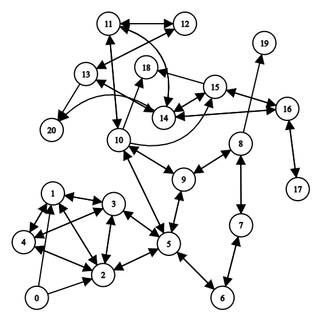

# Fatal Frame V: 'Items' de la zona 'Unfathomable Forest'.
**Proyecto Integral "B" de Programación de Estructuras de Datos.**   

En este proyecto se muestran todas las cosas que pueden recorgerse de esta zona durante el último capítulo del juego en la dificultad *normal*, de igual manera, registra el punto de inicio en la entrada  y el destino por el que se debe de avanzar en el centro-norte del mismo.

   
*Al no poder tomar una imagendel mapa completo, decidí incorporar una de un grafo que **fuera cercano** a las posiciones de los items.*

El programa carga dos archivos con extensión *.txt* y despliega su contenido haciendo uso de 3 funciones disponibles en el menú:   

* Mostrar la lista de objetos: Muestra los datos del archivo *items.txt* después de que estos pasen por una clase que los clasifica por tipos.   
* Mostrar la ruta más rápida para llegar al destino: Muestra los items que pueden ser recogidos en una ruta eficiente hacia el destino haciendo uso de *coordinates.txt* después de ser insertados en un grafo.   
* Mostrar la ruta hacia el destino recogiendo algunos objetos: Haciendo uso del mismo archivo de texto anteriormente mencionado, muestra una ruta que le permite al jugador recoger una mayor cantidad de objetos de camino al destino por una de las tres entradas.   
* Ordenar la cantidad de los Items: Se hace uso del *Counting Algorithm* para llevar a cabo esta operación; solamente muestra las cantidades y no las relaciona con sus respectivos nombres o elementos del objeto de la clase.
**Nota:** Para ver la posición que las funciones indican, será necesario desplegar la lista de items (opción 1).

## SICT0302B: Toma decisiones

### Usa grafos para hacer analisis de información.
El programa carga el archivo *coordinates.txt* para agregar la posición de los objetos dentro del grafo.   

### Usa un algoritmo de búsqueda en grafos adecuado para resolver un problema.

Para dos de las tres funciones disponibles, se hace uso del algoritmo *Breadth-First Search* para encontrar la ruta más óptima para llegar al destino recogiendo la menor cantidad de objetos posibles; por otra parte, se hace uso de *Depth-First Search* para ostrar una ruta que le permitiría al jugador tomar un poco más de objetos a lo largo del mapa.

## SICT0301B: Evalúa los componentes

### Hace un análisis de complejidad correcto y completo para todo el programa y sus compenetes.

* El grafo, que es el elemento principal en este programa, tiene una complejidad de ***O(n + m)*** para el peor de sus casos, esto también aplica para los algortimos de búsqueda utilizados.
* El *Counting Sort* posee una complejidad de ***O(n + k)*** para el peor de sus casos en lo que respecta a tiempo, mientras que, para la complejidad de espacio, para el peor de sus casos posee una de ***O(k)***.

### Presenta Casos de Prueba correctos y completos para todas las funciones y procedimientos del programa.

Se creó un archivo llamado *maintest.cpp* en el cual se evaluaron las funciones principales contenidas en *graph.h*, *Csort.h* e *item.h*.
* .printAdjList(): Devuelve la lista de adyacencia que se tiene entre los nodos.
* .DFS(inicio, fin): Ejecuta el algoritmpo de navegación de nodos *Depth-First Search* el cual muestra una ruta que siempre elige el nodo adycente de mayor tamaño hasta llegar al fin.
* .BFS(inicio, fin): Ejecuta el algoritmpo de navegación de nodos *Breadth-First Search* el cual muestra la ruta *óptima* para llegar al destino; analiza las direcciones que los nodos adyacentes pueden tomar para elegir la más apropiada.
* .setName/Position/Quantity/Type(Valor **int** o **string**): Los sets de la clase *item* funcionan similar para todas las partes del objeto; permiten obtener una parte específica del objeto con un tipo de dato específico, por ejemplo, *.setNombre()* recibe un dato tipo **string** el cual recibe la clasificación de *nombre* dentro del objeto.   
* .getName/Position/Quantity/Type(): Muestra el contenido de un objeto creado por la clase *item* para cada una de sus partes.   
* printArray(*nombre*): Imprime en pantalla el contenido de un array, esto se logra mediante un ciclo *for* que imprime el dato en la *i-ésima* posición del mismo.
* countSort(*nombre*): Se encarga de ordenar los datos dentro de un array mediante el algoritmo con un nombre similar al de la función, para mostrarlo ordenado en pantalla, es necesario utilizar la función anteriormente descrita.   

## SEG0702A Tecnologías de Vanguardia

### Investiga e implementa un algoritmo o una estructura de datos que no se vió durante el curso.

Texto

### Describe cada algoritmo de la estructura (inserción, consulta, etc...) de forma clara y con ejemplos.

Texto

## Recursos utilizados

* https://www.geeksforgeeks.org/counting-sort/
